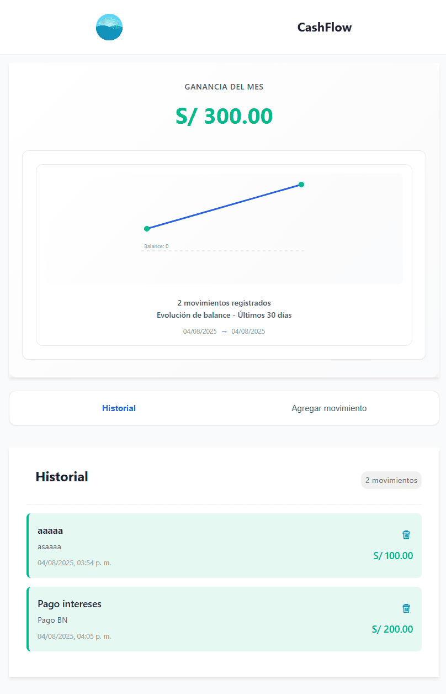

# 💰 Cash Flow

### Descripción

**Cash Flow** es una aplicación moderna desarrollada con Vue.js para el control de ingresos y gastos personales. Permite registrar movimientos financieros, visualizar resúmenes y estadísticas interactivas, todo con una experiencia rápida, responsive y accesible.

---

## 📸 Vista previa del proyecto



---

## ✨ Características Principales

- ✅ **Dashboard Financiero** con gráficos dinámicos.
- ✅ **Registro y edición de movimientos** con validación robusta.
- ✅ **Diseño adaptable** para móviles y escritorio.
- ✅ **Accesibilidad mejorada** con navegación por teclado y focus states.
- ✅ **Persistencia local** automática con LocalStorage.
- ✅ **Formato de moneda internacional** vía Intl API.
- ✅ **Transiciones suaves** y animaciones visuales.

---

### 🛠️ Tecnologías Utilizadas

- 
- 
- 
- 
- 

---

### 🚀 Instalación y Uso

⭣ 1. Clona el repositorio

```console
git clone https://github.com/kevinmadrid-dev/cash-flow.git
```

⭣ 2. Ingresa a la carpeta del proyecto

```console
cd cash-flow
```

⭣ 3. Instala las dependencias

```console
npm install
```

⭣ 4. Ejecuta el servidor de desarrollo

```console
npm run serve
```

--

### Prototipo base en Figma

[Cash Flow in Figma](https://www.figma.com/file/MRah7af6dalQuXIhoqLDa5/Personal-CashFlow?type=design&node-id=0%3A1&mode=design&t=dV7ClP3AUD9uoOAL-1)

--

### Contacto

- GitHub: [kevinmadrid-dev](https://github.com/kevinmadrid-dev)
- LinkedIn: [kevinmadrid-dev](https://www.linkedin.com/in/kevinmadrid-dev/)

⭐ Si te gusta este proyecto, ¡dale una estrella en GitHub!
